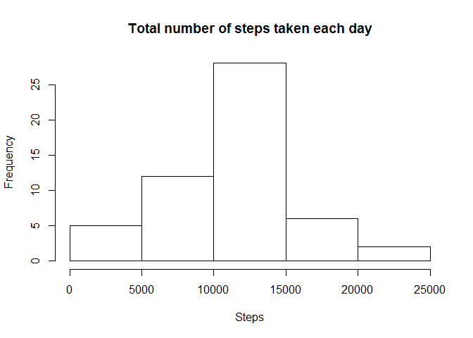
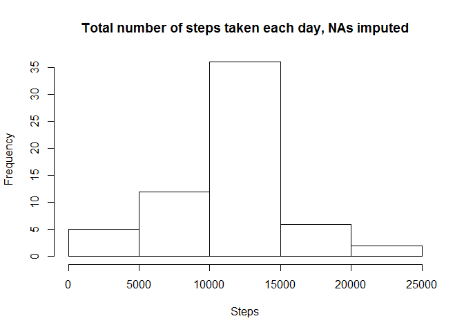
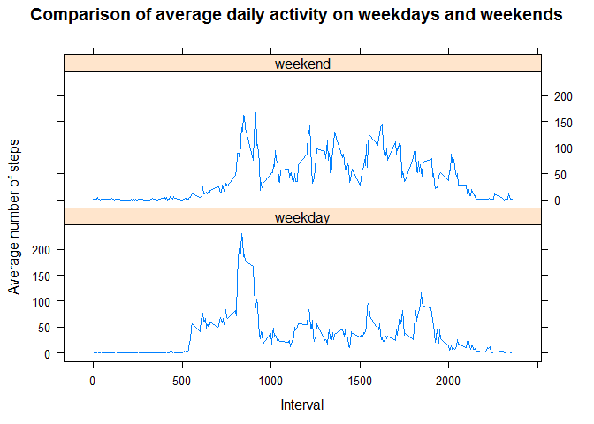

## Loading and preprocessing the data

```r
library(knitr)
```

```
## Warning: package 'knitr' was built under R version 3.4.3
```

```r
library(dplyr)
```

```
## Warning: package 'dplyr' was built under R version 3.4.3
```

```
## 
## Attaching package: 'dplyr'
```

```
## The following objects are masked from 'package:stats':
## 
##     filter, lag
```

```
## The following objects are masked from 'package:base':
## 
##     intersect, setdiff, setequal, union
```

```r
library(lubridate)
```

```
## Warning: package 'lubridate' was built under R version 3.4.3
```

```
## 
## Attaching package: 'lubridate'
```

```
## The following object is masked from 'package:base':
## 
##     date
```

```r
library(lattice)

dat1<-read.csv("activity.csv")
# transform the date 
dat1$date<-ymd(dat1$date)
# create the subset of complete cases
dat2<-dat1[complete.cases(dat1),]
```

## What is mean total number of steps taken per day?

```r
grp1<-group_by(dat2, date)
by_date<-summarize(grp1, tot.steps=sum(steps)) 

# make a histogram
hist(by_date$tot.steps, main = "Total number of steps taken each day",
                        xlab = "Steps")
```

<!-- -->

Mean total number of steps taken per day

```r
mean(by_date$tot.steps, na.rm = TRUE)
```

```
## [1] 10766.19
```
Median total number of steps taken per day

```r
median(by_date$tot.steps, na.rm = TRUE)
```

```
## [1] 10765
```

## What is the average daily activity pattern?

```r
grp2<-group_by(dat2,interval)
by_interval<-summarize(grp2, avg.steps=mean(steps))

# make a time series plot
with(by_interval, plot(interval, avg.steps, type="l", xlab="Interval", 
                       ylab="Average number of steps",
                       main="Average number of steps per interval"))
```

<!-- -->

Which 5-minute interval, on average across all the days, contains the maximum number of steps?

```r
max_interval<-by_interval[which.max(by_interval$avg.steps),]
max_interval
```

```
## # A tibble: 1 x 2
##   interval avg.steps
##      <int>     <dbl>
## 1      835  206.1698
```
The interval 835 has the maximum number of steps, ~206.2.

## Imputing missing values
Let's see what is the total number of missing values in the data set:

```r
sum(is.na(dat1$steps))
```

```
## [1] 2304
```
Let's impute them with the average number of steps for the corresponding interval.

```r
dat1$steps1<-replace(dat1$steps, dat1$interval %in% by_interval$interval, 
                     by_interval$avg.steps)
dat1$steps2<-replace(dat1$steps, is.na(dat1$steps), dat1$steps1)
```

```
## Warning in x[list] <- values: number of items to replace is not a multiple
## of replacement length
```
Let's see how/if the distribution has changed after imputaion.

```r
# make a histogram
grp3<-group_by(dat1, date)
by_date1<-summarize(grp3, tot.steps=sum(steps2))

hist(by_date1$tot.steps, xlab = "Steps",
      main = "Total number of steps taken each day, NAs imputed"
     )
```

<!-- -->

Comparing Fig1 and Fig3, we can see the expected change:
there are more days in the middle of the distribution.

Let's see if there is any change in the mean and median of the total number of steps taken per day.
Mean:

```r
mean(by_date1$tot.steps)
```

```
## [1] 10766.19
```
Median:

```r
median(by_date1$tot.steps)
```

```
## [1] 10766.19
```

As we have expected from the method we used for imputing the missing values, the mean has not changed, and the median increased very slightly, and is now equal to mean.

## Are there differences in activity patterns between weekdays and weekends?

```r
# create a factor variable for weekday / weekend
dat1$wday<-weekdays(dat1$date)

dat1$dow<-replace(dat1$wday, dat1$wday=="Saturday"| dat1$wday=="Sunday", "weekend")
dat1$dow<-replace(dat1$dow, dat1$dow!="weekend", "weekday")
dat1$dow<-as.factor(dat1$dow)

# make a panel plot comparing average activity by 5-minute intervals on weekdays and weekends
grp4<-group_by(dat1, interval, dow)
by_ig<-summarize(grp4, avg.steps=mean(steps2))

xyplot(avg.steps ~ interval | dow, data=by_ig, type="l", layout=c(1,2),
       xlab = "Interval", ylab = "Average number of steps",
       main = "Comparison of average daily activity on weekdays and weekends")
```

<!-- -->

It looks like there is more walking activity on weekends, with the steps more equally distriuted throughout the day. On the weekday, the peak of walking activity is in the morning, when people get to work. Another, less profound peak is in the evening, when people leave work.
